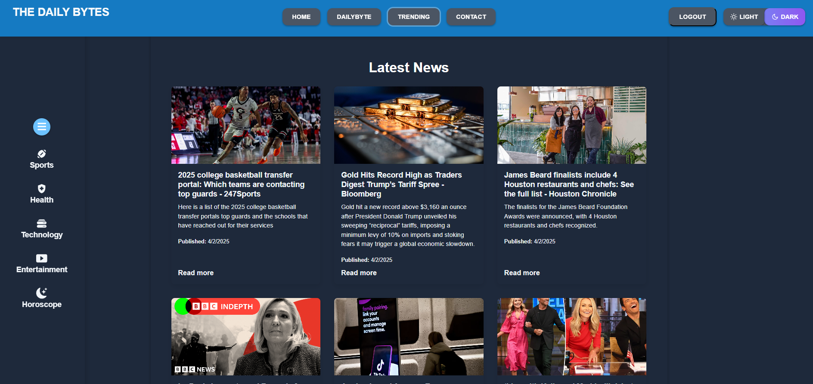

# The Daily Bites 📰

## Description

The Daily Bites is a sleek and interactive web portfolio showcasing my web development journey and projects. It highlights my skills in HTML, CSS, JavaScript, React, and more.

## 🚀 Motivation

This project was created to present my work in a visually appealing and user-friendly way, perfect for potential employers or collaborators. The goal was to make it easy for anyone to explore my skills and projects.

## 🔧 Purpose

A centralized platform to showcase my projects and experience. It provides easy access to live sites and GitHub repositories, enabling employers or clients to see my work firsthand.

## 💡 What I Learned

Through building this project, I strengthened my expertise in React, CSS, JavaScript, and responsive design. I also learned how to build a modern, interactive, and user-centric portfolio.

## 📑 Table of Contents

- [Installation](#installation)
- [Usage](#usage)
- [Credits](#credits)
- [License](#license)

---

## 🛠️ Installation

1. Clone the repository:
    ```bash
    git clone https://github.com/n6dd/The-Daily-Bytes.git
    ```

2. Navigate into the project directory:
    ```bash
    cd The-Daily-Bytes
    ```

3. Install the required dependencies:
    ```bash
    npm install
    ```

4. Run the app:
    ```bash
    npm run start
    # Or use the following for development:
    npm run start:dev
    ```

5. Open your browser at `http://localhost:3000` to view the project.

---

## 💻 Usage

- **About**: A brief introduction to who I am.
- **Resume**: A downloadable PDF of my resume.
- **Portfolio**: Showcase of my previous web development projects, with links to live sites and GitHub repositories.
- **Contact**: A form to get in touch with me.

## 📸 Screenshot



---

## 🎉 Credits

I used the following technologies and libraries:
- [React](https://reactjs.org/) for the frontend framework.
- [Vite](https://vitejs.dev/) for development and build tools.
- [React Icons](https://react-icons.github.io/react-icons/) for modern icons.

## 📜 License

This project is licensed under the MIT License. See the [LICENSE](LICENSE) file for details.

---

## 🌐 Live Demo & GitHub

Check out the live demo and GitHub repositories:

## 🌟 [Live Demo](https://the-daily-bytes-o4jo.onrender.com)
## 💻 [GitHub Repository](https://github.com/n6dd/The-Daily-Bytes)

---
